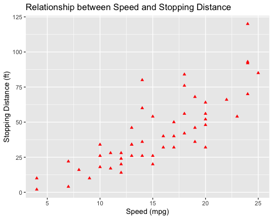
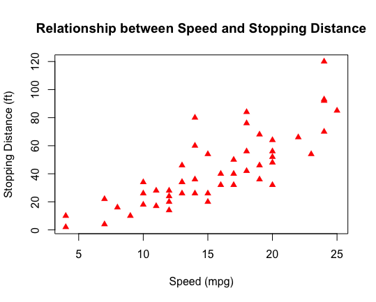

# Data Analysis & Visualization with R Homework  
Zora Zhang, lesson 2  

### Question 1: Dplyr Review  
Champions.csv records 100 Champion's League matches between different soccer clubs. Note that this dataset is generated from simulation (not the real match history).  
1. Use filter to find out rows (games) that home team wins, i.e., HomeGoal > AwayGoal 
```{r}
> champions <- read.csv("Champions.csv")
# using dplyr filter 
> filter(champions, HomeGoal > AwayGoal)
# using conditional row selection
> champions[champions$HomeGoal > champions$AwayGoal,]
```
2. Use filter to find out rows that the HomeTeam is either "Barcelona" or "Real Madrid"  
```{r}
# using dplyr filter
> filter(champions, HomeTeam == "Barcelona" | HomeTeam == "Real Madrid")
# using conditional row selection
> champions[champions$HomeTeam == "Barcelona"|champions$HomeTeam == "Real Madrid",]
```
3. Create another table which only includes 6 columns: HomeTeam, AwayTeam, HomeGoal, AwayGoal, HomeCorner, and AwayCorner  
```{r}
# with dplyr
> champ <- select(champions, contains(c("HomeTeam", "AwayTeam", "HomeGoal", "AwayGoal", "HomeCorner", "AwayCorner")))
# or 
> champ2 <- select(champions, "HomeTeam", "AwayTeam", "HomeGoal", "AwayGoal", "HomeCorner", "AwayCorner")
# checking
> colnames(champ)
[1] "HomeTeam"   "AwayTeam"   "HomeGoal"   "AwayGoal"   "HomeCorner" "AwayCorner"
# without dplyr 
> champ2 <- champions[, c("HomeTeam", "AwayTeam", "HomeGoal", "AwayGoal", "HomeCorner", "AwayCorner")]
```  
4. Use arrange to reorder the dataset by the number home goals  
```{r}
arrange(champions, HomeGoal)
```
5. For each HomeTeam, find out its average HomeGoal, average HomePossession (possession rate), and average HomeYellow (number of yellow cards), summarise the results in a table  
```{r}
> champions %>% 
     group_by(HomeTeam) %>%
     summarise(avgHomeGoal = mean(HomeGoal), avgHomePossession = mean(HomePossession),
               avgHomeYellow = mean(HomeYellow))
               
   HomeTeam        avgHomeGoal avgHomePossession avgHomeYellow
   <chr>                 <dbl>             <dbl>         <dbl>
 1 AC Milan               1.56              48.8          1.89
 2 Arsenal                1                 50.9          2.14
 3 Atletico Madrid        2.67              58            2.17
 4 Barcelona              2                 49.3          2.33
 5 Bayern Munich          1.73              51.6          2   
 6 Chelsea                2                 52.4          2.2 
 7 Dortmund               1.3               55.2          2.3 
 8 Inter Milan            1.2               54.7          1.7 
 9 Juventus               1.5               50            1.33
10 Leverkusen             2.1               56.2          2.4 
11 Liverpool              1.75              53.2          2   
12 Man United             0.5               51            2.67
13 Paris SG               1.75              56.8          2.75
14 Real Madrid            0.75              55            3.5 
```
### Question 2: Scatterplot  
The data frame cars in the datasets package records the speed (in mph ) and stopping distance (in ft ) for 50 cars.  
1. Create a scatterplot of dist (y-axis) vs. speed (x-axis)   
```{r}
# with ggplot2
> ggplot(cars,
        aes(x = speed, y = dist)) +
     geom_point()
# without ggplot2
> plot(x = cars$speed, y = cars$dist)
```
2. Refine the basic plot by labeling the x-axis with "Speed (mpg)" and the y-axis with "Stopping Distance (ft)", add a title to the plot with "Relationship between Speed and Stopping Distance"  
```{r}
> ggplot(cars,
        aes(x = speed, y = dist)) +
     geom_point() +
     labs(x = "Speed (mpg)", y = "Stopping Distance (ft)", title = "Relationship between Speed and Stopping Distance")
```
3. Revise the plot by changing the every point from the default open circles to red filled triangles  
```{r}
# with ggplot2
> ggplot(cars,
        aes(x = speed, y = dist)) +
     geom_point(shape = 17, color = "red") +
     labs(x = "Speed (mpg)", y = "Stopping Distance (ft)", title = "Relationship between Speed and Stopping Distance")
# without ggplot2
> plot(x = cars$speed, y = cars$dist, xlab = "Speed (mpg)", ylab = "Stopping Distance (ft)", main = "Relationship between Speed and Stopping Distance", col = "red", pch = 17)
```
Final result:  
  
